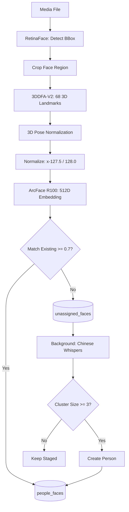

# Face Recognition System Implementation

## Architecture Overview




## Database Schema Changes

### Migration SQL File

**File**: `src/model/store/sql/library/XXX - FACE RECOGNITION.sql`

```sql
-- Drop old table (data loss acceptable as confirmed)
DROP TABLE IF EXISTS people_faces;

-- Assigned faces linked to identified people
CREATE TABLE people_faces (
    id TEXT PRIMARY KEY,
    people_ref TEXT NOT NULL,
    embedding BLOB NOT NULL,  -- Raw little-endian f32 (512 × 4 bytes = 2048 bytes)
    media_ref TEXT,
    bbox TEXT,  -- JSON: {"x1": f32, "y1": f32, "x2": f32, "y2": f32}
    confidence REAL,
    pose TEXT,  -- JSON: {"pitch": f32, "yaw": f32, "roll": f32} (optional)
    created INTEGER,
    FOREIGN KEY (people_ref) REFERENCES people(id),
    FOREIGN KEY (media_ref) REFERENCES medias(id)
);
CREATE INDEX idx_people_faces_person ON people_faces(people_ref);
CREATE INDEX idx_people_faces_media ON people_faces(media_ref);

-- Staging area for unassigned faces
CREATE TABLE unassigned_faces (
    id TEXT PRIMARY KEY,
    embedding BLOB NOT NULL,  -- Raw little-endian f32 (512 × 4 bytes = 2048 bytes)
    media_ref TEXT NOT NULL,
    bbox TEXT NOT NULL,
    confidence REAL NOT NULL,
    pose TEXT,  -- JSON: {"pitch": f32, "yaw": f32, "roll": f32}
    cluster_id TEXT,  -- Set by clustering algorithm
    created INTEGER NOT NULL,
    processed INTEGER DEFAULT 0,  -- Boolean: considered for clustering
    FOREIGN KEY (media_ref) REFERENCES medias(id)
);
CREATE INDEX idx_unassigned_faces_media ON unassigned_faces(media_ref);
CREATE INDEX idx_unassigned_faces_cluster ON unassigned_faces(cluster_id);
CREATE INDEX idx_unassigned_faces_created ON unassigned_faces(created);
CREATE INDEX idx_unassigned_faces_processed ON unassigned_faces(processed);

-- Track face processing status
ALTER TABLE medias ADD COLUMN face_processed INTEGER DEFAULT 0;
```

**BLOB Storage Format (CRITICAL):**

- **Format**: Raw little-endian f32 bytes (native for x86/ARM)
- **Size**: 512 floats × 4 bytes = 2048 bytes per embedding
- **Write**: `bytemuck::cast_slice::<f32, u8>(&embedding).to_vec()`
- **Read**: `bytemuck::cast_slice::<u8, f32>(&blob)` (zero-copy, direct &[f32])
- **Performance**: Perfect for ~10k faces with O(n) similarity search

## Core Implementation

### 1. Recognition Module with 3DDFA-V2

**File**: [`src/tools/recognition.rs`](src/tools/recognition.rs)**Three ONNX sessions required:**

```rust
pub struct FaceRecognitionService {
    detection_session: Arc<Session>,   // RetinaFace (640×608 input)
    alignment_session: Arc<Session>,    // 3DDFA-V2 (120×120 input)
    recognition_session: Arc<Session>,  // ArcFace R100 (112×112 input)
}

#[derive(Debug, Clone)]
pub struct DetectedFace {
    pub bbox: BBox,
    pub landmarks_68: Vec<(f32, f32, f32)>,  // 68 3D landmarks
    pub pose: (f32, f32, f32),                 // (pitch, yaw, roll) radians
    pub confidence: f32,
    pub embedding: Vec<f32>,                   // 512-dim, L2-normalized
    pub aligned_image: Option<DynamicImage>,   // 112×112 frontal face
}

struct Face3DInfo {
    landmarks_3d: Vec<(f32, f32, f32)>,  // 68 points in 3D
    pose: (f32, f32, f32),                // (pitch, yaw, roll)
}
```

**Initialization with thread control:**

```rust
impl FaceRecognitionService {
    pub fn new(models_path: &str) -> RsResult<Self> {
        // CRITICAL: Set intra_threads(1) to prevent CPU thrashing
        let detection_session = Session::builder()?
            .with_optimization_level(GraphOptimizationLevel::Level3)?
            .with_intra_threads(1)?
            .commit_from_file(format!("{}/retinaface.onnx", models_path))?;
            
        let alignment_session = Session::builder()?
            .with_optimization_level(GraphOptimizationLevel::Level3)?
            .with_intra_threads(1)?
            .commit_from_file(format!("{}/3ddfa_v2.onnx", models_path))?;
            
        let recognition_session = Session::builder()?
            .with_optimization_level(GraphOptimizationLevel::Level3)?
            .with_intra_threads(1)?
            .commit_from_file(format!("{}/arcface_r100.onnx", models_path))?;
            
        Ok(Self {
            detection_session: Arc::new(detection_session),
            alignment_session: Arc::new(alignment_session),
            recognition_session: Arc::new(recognition_session),
        })
    }
    
    // CRITICAL: Async wrapper using spawn_blocking
    pub async fn detect_and_extract_faces_async(
        &self,
        image: DynamicImage
    ) -> RsResult<Vec<DetectedFace>> {
        let service = self.clone();
        tokio::task::spawn_blocking(move || {
            service.detect_and_extract_faces_blocking(&image)
        })
        .await
        .map_err(|e| RsError::Error(format!("Join error: {}", e)))?
    }
}
```

**Two-stage pipeline implementation:**

```rust
fn detect_and_extract_faces_blocking(&self, image: &DynamicImage) -> RsResult<Vec<DetectedFace>> {
    // Stage 1: RetinaFace detection
    let detections = self.detect_faces_retinaface(image)?;
    
    let mut faces = Vec::new();
    for det in detections {
        // Stage 2: Crop with 30% padding
        let face_crop = self.crop_face_with_padding(image, &det.bbox, 0.3)?;
        
        // Stage 3: 3DDFA-V2 reconstruction
        let face_3d = self.reconstruct_face_3d(&face_crop)?;
        
        // Stage 4: Normalize to frontal pose
        let aligned = self.normalize_to_frontal(&face_crop, &face_3d)?;
        
        // Stage 5: Extract embedding
        let embedding = self.extract_embedding(&aligned)?;
        
        faces.push(DetectedFace {
            bbox: det.bbox,
            landmarks_68: face_3d.landmarks_3d,
            pose: face_3d.pose,
            confidence: det.confidence,
            embedding,
            aligned_image: Some(aligned),
        });
    }
    Ok(faces)
}

fn reconstruct_face_3d(&self, face_crop: &DynamicImage) -> RsResult<Face3DInfo> {
    let resized = face_crop.resize_exact(120, 120, FilterType::Triangle);
    let input = preprocess_for_3ddfa(&resized);
    let tensor = Tensor::from_array(input)?;
    
    let outputs = self.alignment_session.run(ort::inputs!["input" => tensor]?)?;
    
    // Parse 3DDFA outputs (check model spec for exact format)
    let param: ArrayD<f32> = outputs[0].try_extract_tensor()?.to_owned();
    
    // Extract 68 landmarks from 3DMM parameters
    let landmarks_3d = reconstruct_68_landmarks_from_params(&param)?;
    
    // Extract pose (pitch, yaw, roll)
    let pose = extract_pose_from_params(&param)?;
    
    Ok(Face3DInfo { landmarks_3d, pose })
}

fn normalize_to_frontal(&self, face_crop: &DynamicImage, face_3d: &Face3DInfo) -> RsResult<DynamicImage> {
    // Use 68 3D landmarks for robust transformation
    let canonical_landmarks = get_canonical_68_landmarks_3d();
    
    // Compute 3D similarity transform (accounts for pitch/yaw/roll)
    let transform = compute_3d_similarity_transform(
        &face_3d.landmarks_3d,
        &canonical_landmarks,
        &face_3d.pose
    )?;
    
    // Warp to 112×112 frontal view
    let aligned = warp_3d_face(face_crop, &transform, 112, 112)?;
    
    Ok(aligned)
}

fn extract_embedding(&self, aligned_face: &DynamicImage) -> RsResult<Vec<f32>> {
    // CRITICAL: ArcFace normalization
    let input = preprocess_for_arcface(aligned_face);
    let tensor = Tensor::from_array(input)?;
    
    let outputs = self.recognition_session.run(ort::inputs!["input" => tensor]?)?;
    let embedding: ArrayD<f32> = outputs[0].try_extract_tensor()?.to_owned();
    
    // L2 normalize for cosine similarity
    let embedding_vec: Vec<f32> = embedding.iter().copied().collect();
    let normalized = l2_normalize(&embedding_vec);
    
    Ok(normalized)
}
```

**CRITICAL: Preprocessing functions**

```rust
// ArcFace: (pixel - 127.5) / 128.0 → [-1, 1]
fn preprocess_for_arcface(img: &DynamicImage) -> Array4<f32> {
    let rgb = img.to_rgb8();
    let mut input = Array4::<f32>::zeros((1, 3, 112, 112));
    
    for y in 0..112 {
        for x in 0..112 {
            let pixel = rgb.get_pixel(x, y);
            input[[0, 0, y as usize, x as usize]] = (pixel[0] as f32 - 127.5) / 128.0;
            input[[0, 1, y as usize, x as usize]] = (pixel[1] as f32 - 127.5) / 128.0;
            input[[0, 2, y as usize, x as usize]] = (pixel[2] as f32 - 127.5) / 128.0;
        }
    }
    input
}

// 3DDFA: ImageNet normalization
fn preprocess_for_3ddfa(img: &DynamicImage) -> Array4<f32> {
    let rgb = img.to_rgb8();
    let mut input = Array4::<f32>::zeros((1, 3, 120, 120));
    
    let mean = [0.485, 0.456, 0.406];
    let std = [0.229, 0.224, 0.225];
    
    for y in 0..120 {
        for x in 0..120 {
            let pixel = rgb.get_pixel(x, y);
            input[[0, 0, y as usize, x as usize]] = ((pixel[0] as f32 / 255.0) - mean[0]) / std[0];
            input[[0, 1, y as usize, x as usize]] = ((pixel[1] as f32 / 255.0) - mean[1]) / std[1];
            input[[0, 2, y as usize, x as usize]] = ((pixel[2] as f32 / 255.0) - mean[2]) / std[2];
        }
    }
    input
}

fn l2_normalize(v: &[f32]) -> Vec<f32> {
    let norm: f32 = v.iter().map(|x| x * x).sum::<f32>().sqrt();
    v.iter().map(|x| x / norm).collect()
}
```


### 2. Database Operations

**File**: [`src/model/store/sql/library/people.rs`](src/model/store/sql/library/people.rs)

```rust
// Add to unassigned staging
pub async fn add_unassigned_face(
    &self,
    face_id: String,
    embedding: Vec<f32>,
    media_id: String,
    bbox: (f32, f32, f32, f32),
    confidence: f32,
    pose: Option<(f32, f32, f32)>
) -> Result<()> {
    self.connection.call(move |conn| {
        let embedding_blob = bytemuck::cast_slice::<f32, u8>(&embedding).to_vec();
        let bbox_json = serde_json::to_string(&bbox)?;
        let pose_json = pose.map(|p| serde_json::to_string(&p)).transpose()?;
        
        conn.execute(
            "INSERT INTO unassigned_faces (id, embedding, media_ref, bbox, confidence, pose, created) 
             VALUES (?, ?, ?, ?, ?, ?, ?)",
            params![face_id, embedding_blob, media_id, bbox_json, confidence, pose_json, chrono::Utc::now().timestamp_millis()]
        )?;
        Ok(())
    }).await
}

// Get unassigned faces (ZERO-COPY read)
pub async fn get_unassigned_faces(&self) -> Result<Vec<UnassignedFace>> {
    self.connection.call(|conn| {
        let mut stmt = conn.prepare(
            "SELECT id, embedding, media_ref, bbox, confidence, pose, cluster_id, created 
             FROM unassigned_faces WHERE processed = 0"
        )?;
        
        let rows = stmt.query_map([], |row| {
            let embedding_blob: Vec<u8> = row.get(1)?;
            let embedding: &[f32] = bytemuck::cast_slice(&embedding_blob);
            
            Ok(UnassignedFace {
                id: row.get(0)?,
                embedding: embedding.to_vec(),
                media_ref: row.get(2)?,
                bbox: serde_json::from_str(&row.get::<_, String>(3)?).unwrap(),
                confidence: row.get(4)?,
                pose: row.get::<_, Option<String>>(5)?.and_then(|s| serde_json::from_str(&s).ok()),
                cluster_id: row.get(6)?,
                created: row.get(7)?,
            })
        })?;
        
        rows.collect::<rusqlite::Result<Vec<_>>>()
    }).await
}

// Add to assigned faces
pub async fn add_face_embedding(
    &self,
    face_id: String,
    person_id: &str,
    embedding: Vec<f32>,
    media_id: Option<String>,
    bbox: Option<(f32, f32, f32, f32)>,
    confidence: f32,
    pose: Option<(f32, f32, f32)>
) -> Result<()>;

// Get all embeddings for matching
pub async fn get_all_embeddings(&self) -> Result<Vec<(String, Vec<f32>)>>;

// Clustering operations
pub async fn assign_cluster_to_faces(&self, face_ids: Vec<String>, cluster_id: String) -> Result<()>;
pub async fn promote_cluster_to_person(&self, cluster_id: String, person_id: String) -> Result<()>;
```


### 3. Matching and Clustering Logic

**File**: [`src/model/people.rs`](src/model/people.rs)

```rust
impl ModelController {
    pub async fn process_media_faces(
        &self,
        library_id: &str,
        media_id: &str,
        requesting_user: &ConnectedUser
    ) -> RsResult<Vec<DetectedFaceResult>> {
        let image = self.load_media_image(library_id, media_id, requesting_user).await?;
        let service = self.get_face_recognition_service()?;
        let faces = service.detect_and_extract_faces_async(image).await?;
        
        let store = self.store.get_library_store(library_id)?;
        
        for face in &faces {
            // Try matching with 0.7 threshold
            if let Some((person_id, _sim)) = self.match_face_to_person(library_id, &face.embedding, 0.7).await? {
                // High confidence → assign directly
                let face_id = nanoid!();
                store.add_face_embedding(
                    face_id, &person_id, face.embedding.clone(),
                    Some(media_id.to_string()), Some((face.bbox.x1, face.bbox.y1, face.bbox.x2, face.bbox.y2)),
                    face.confidence, Some(face.pose)
                ).await?;
            } else {
                // No match → stage for clustering
                let face_id = nanoid!();
                store.add_unassigned_face(
                    face_id, face.embedding.clone(), media_id.to_string(),
                    (face.bbox.x1, face.bbox.y1, face.bbox.x2, face.bbox.y2),
                    face.confidence, Some(face.pose)
                ).await?;
            }
        }
        
        store.mark_media_face_processed(media_id).await?;
        Ok(vec![])
    }
    
    // Background clustering job
    pub async fn cluster_unassigned_faces(&self, library_id: &str) -> RsResult<ClusteringResult> {
        let store = self.store.get_library_store(library_id)?;
        let unassigned = store.get_unassigned_faces().await?;
        
        if unassigned.len() < 3 {
            return Ok(ClusteringResult { clusters_created: 0 });
        }
        
        // Chinese Whispers clustering (CPU-bound)
        let clusters = tokio::task::spawn_blocking(move || {
            chinese_whispers_clustering(&unassigned, 0.7)
        }).await?;
        
        let mut created = 0;
        for (cluster_id, face_ids) in clusters {
            if face_ids.len() >= 3 {
                let person = self.create_person_from_cluster(library_id, &cluster_id, &face_ids).await?;
                store.promote_cluster_to_person(cluster_id, person.id).await?;
                created += 1;
            } else {
                store.assign_cluster_to_faces(face_ids, cluster_id).await?;
            }
        }
        
        Ok(ClusteringResult { clusters_created: created })
    }
    
    async fn match_face_to_person(&self, library_id: &str, embedding: &[f32], threshold: f32) -> RsResult<Option<(String, f32)>> {
        let store = self.store.get_library_store(library_id)?;
        let all_embeddings = store.get_all_embeddings().await?;
        
        let mut best_match: Option<(String, f32)> = None;
        for (person_id, person_emb) in all_embeddings {
            let sim = cosine_similarity(embedding, &person_emb);
            if sim >= threshold && (best_match.is_none() || sim > best_match.as_ref().unwrap().1) {
                best_match = Some((person_id, sim));
            }
        }
        Ok(best_match)
    }
}

fn cosine_similarity(a: &[f32], b: &[f32]) -> f32 {
    assert_eq!(a.len(), b.len());
    // Assuming L2-normalized embeddings: cosine = dot product
    a.iter().zip(b).map(|(x, y)| x * y).sum()
}

fn chinese_whispers_clustering(faces: &[UnassignedFace], threshold: f32) -> HashMap<String, Vec<String>> {
    // 1. Build similarity graph
    // 2. Initialize unique labels
    // 3. Iterate until convergence: adopt most common neighbor label
    // 4. Return clusters
    todo!("Implement Chinese Whispers algorithm")
}
```


### 4. API Routes

**File**: [`src/routes/people.rs`](src/routes/people.rs)

```rust
pub fn routes(mc: ModelController) -> Router {
    Router::new()
        // ... existing routes ...
        .route("/detect-faces", post(handler_detect_faces_in_media))
        .route("/cluster-faces", post(handler_cluster_unassigned_faces))
        .route("/unassigned-faces", get(handler_get_unassigned_faces))
        .route("/batch-detect", post(handler_batch_detect_faces))
        .route("/:id/faces", get(handler_get_person_faces))
        .route("/faces/:face_id", delete(handler_delete_face))
        .route("/merge", post(handler_merge_people))
        .with_state(mc)
}
```


### 5. Configuration

```rust
pub struct FaceRecognitionConfig {
    pub enabled: bool,
    pub similarity_threshold: f32,      // Default: 0.7
    pub min_detection_confidence: f32,  // Default: 0.5
    pub min_cluster_size: usize,        // Default: 3
    pub clustering_threshold: f32,      // Default: 0.7
    pub max_faces_per_image: usize,     // Default: 20
    pub models_path: String,            // Path to ONNX models
}
```


### 6. Concurrency Control

```rust
// Batch processing with buffer_unordered(4)
let results = stream::iter(media_ids)
    .map(|media_id| {
        let mc = self.clone();
        async move {
            mc.process_media_faces(library_id, &media_id, requesting_user).await
        }
    })
    .buffer_unordered(4)  // 4 concurrent images
    .collect::<Vec<_>>()
    .await;
```


## Model Files Required

**Location**: Project root or `models/` directory

1. **retinaface.onnx** (existing) - Face detection
2. **3ddfa_v2.onnx** (~100MB) - 3D face alignment

- Download from [3DDFA_V2 GitHub](https://github.com/cleardusk/3DDFA_V2)
- Export ONNX or use pre-converted model
- Input: 1×3×120×120, Output: 3DMM parameters

3. **arcface_r100.onnx** (~250MB) - Face recognition

- Download from InsightFace or ONNX Model Zoo
- Input: 1×3×112×112, Output: 1×512

## Critical Implementation Checklist

- [ ] **ArcFace normalization**: `(pixel - 127.5) / 128.0` → [-1, 1]
- [ ] **3DDFA normalization**: ImageNet mean/std
- [ ] **BLOB format**: Little-endian f32, use bytemuck
- [ ] **Async safety**: spawn_blocking for all ONNX inference
- [ ] **Thread control**: with_intra_threads(1) on all sessions
- [ ] **Threshold**: 0.7 for matching and clustering
- [ ] **Staging**: No Person until cluster has 3+ faces
- [ ] **68 landmarks**: Use all landmarks for robust 3D alignment

## Dependencies

```toml
[dependencies]
bytemuck = { version = "1.14", features = ["derive"] }
# ... existing deps ...
```


## Files to Modify

1. [`src/tools/recognition.rs`](src/tools/recognition.rs) - Three-stage pipeline
2. [`src/model/store/sql/library/people.rs`](src/model/store/sql/library/people.rs) - BLOB ops
3. [`src/model/people.rs`](src/model/people.rs) - Matching + clustering
4. [`src/routes/people.rs`](src/routes/people.rs) - API endpoints
5. [`src/model/medias.rs`](src/model/medias.rs) - Integration
6. `src/model/store/sql/library/XXX - FACE RECOGNITION.sql` - Migration

## Success Criteria

- ✅ Handles non-frontal faces (profile, up/down angles)
- ✅ Correct normalization (verify embeddings stable)
- ✅ No async executor blocking
- ✅ Clean people table (only clusters with 3+ faces)